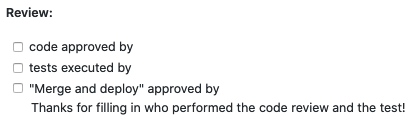

# Approving PRs going into production

All tools developed at clinical genomics need to be tested, reviewed and deployed according to a specific routine which is generally outlined under ["How to install your tool in production"][prod].
 
When on a branch that will be merged and deployed to production - these three things also need a sign-off; _Code Reviewed by_, _Tests Executed by_ and _Merge and Deploy_. 
There are different branching models used at Clinical Genomics and depending on which you use the sign-offs happen at slightly different steps in the update process.
  
  For functions and signatures (see AM document `1047 Functions and signature list`)

### Signing-off on code reviews
* Code owner(s) or responsible in AM #1098 of the specific repository

### Signing-off on test results
* Anyone with enough knowledge to make a critical review

### Signing-off on merge and deploy
* Code owner(s) or responsible in AM #1098 of the specific repository

### Signing-off AM Validations
* Validation and implementation plan - Management team member, Facility manager and Quality control manager.
Validation and implementation plan templates are available in AM (`1249 Validation Report - Template` and `1187 Implementation plan - template`)

## Github flow
In this model the sign-offs of patch and minor versions all happen in the pull request.
 The developer will create a pull request to master and then fill the PR template with content.

### PR review cycle
   - Execute test and document test results
   - Code review

### Approving
This process is described in more detail in ["How to install your tool in production"][prod].

   - The code owner or responsible in AM #1098 ticks the box when the code has been deemed adequate and signs it 
   - The person carrying out the tests on stage according to the test case described in the pull request can tick off the "tests executed box"  and sign it, when the tests meet the pass criteria.
   - The code owner or responsible in AM #1098 ticks the "merge/deploy" box approves the pull request and signs it.

#### Major versions
To merge a major version into master - AM Test specification and implementation plan are needed on system testing (testing of the feature branch to be deployed) and decision to merge to master and deploy the code.

## Git flow
In this model several pull requests are bunched in the same release and it is therefore necessary to do the sign-offs in three steps:

### Development branch
- Pull request to add changes to the development branch - perform code review and testing before merging as described under Github flow.

### Master branch
- AM Test specification and implementation plan are needed on system testing (testing of the release branch to be deployed) and the approved decision to merge to master and deploy the code to production.
- Merging patches to master do not need AM validations and follows the same procedure as github flow for patches.

[prod]: prod.md
